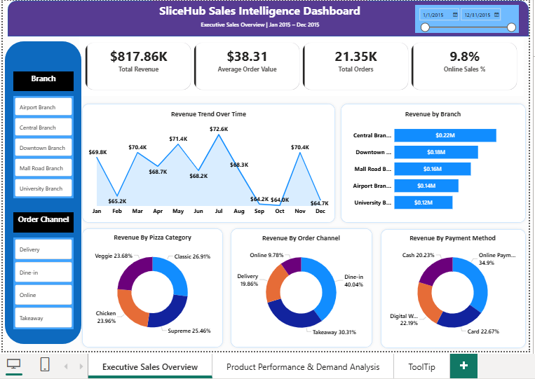
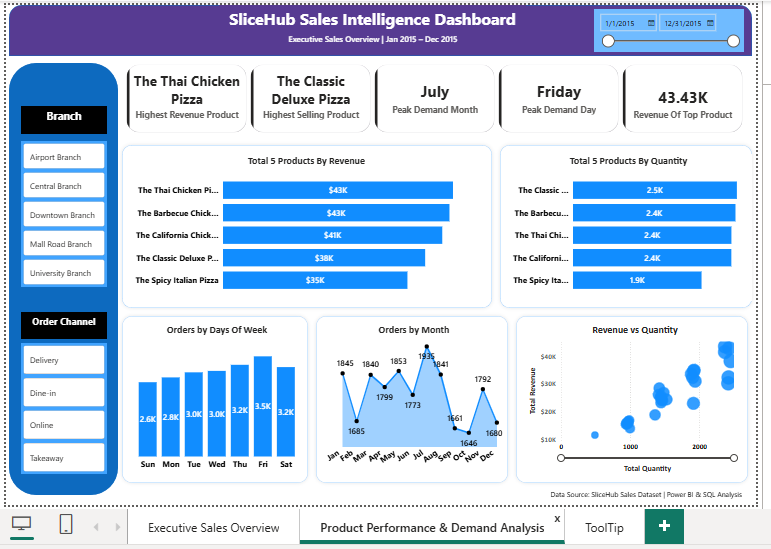

# SliceHub Sales Intelligence Dashboard

## Project Overview

This project presents an end-to-end Sales Intelligence Dashboard developed using Power BI, SQL, Excel, DAX, and Power Query.

The objective was to transform raw sales transaction data into actionable business insights through interactive dashboards while independently validating key business metrics using SQL.

The dashboard provides visibility into sales performance, product profitability, branch performance, customer ordering behavior, and demand trends.

## Project Highlights

* Built an end-to-end Sales Intelligence Dashboard using Power BI.
* Created custom DAX measures for KPI tracking and product performance analysis.
* Performed SQL-based validation of dashboard metrics.
* Designed interactive dashboards with slicers, custom tooltips, and business-focused visualizations.
* Analyzed revenue trends, branch performance, product profitability, and customer demand patterns.
* Applied business storytelling principles to convert raw transactional data into actionable insights.

---

## Business Objectives

* Monitor overall revenue and order performance.
* Identify top-performing products.
* Analyze sales contribution across branches and order channels.
* Understand customer demand patterns and seasonality.
* Validate Power BI KPIs using SQL queries.

---

## Tools & Technologies

* Power BI
* DAX
* Power Query
* SQL
* Microsoft Excel

---

## Dashboard Pages

### 1. Executive Sales Overview

This page provides a high-level view of business performance.

#### Key Metrics

* Total Revenue
* Average Order Value
* Total Orders
* Online Sales Percentage

#### Visualizations

* Revenue Trend Over Time
* Revenue by Branch
* Revenue by Product Category
* Revenue by Order Channel
* Revenue by Payment Method

#### Interactive Filters

* Branch
* Order Channel
* Date Range

---

### 2. Product Performance & Demand Analysis

This page focuses on product-level insights and customer demand patterns.

#### Key Metrics

* Highest Revenue Product
* Highest Selling Product
* Peak Demand Month
* Peak Demand Day
* Revenue of Top Product

#### Visualizations

* Top Products by Revenue
* Top Products by Quantity
* Orders by Day of Week
* Orders by Month
* Revenue vs Quantity Scatter Analysis

#### Custom Tooltips

Additional product-level information is available through report tooltips:

* Revenue
* Quantity Sold
* Total Orders
* Product Category

---

## Key Insights

* Thai Chicken Pizza generated the highest revenue.
* Classic Deluxe Pizza achieved the highest sales volume.
* July recorded the highest order volume.
* Friday was the peak demand day.
* Central Branch contributed the highest revenue.
* Dine-in orders represented the largest sales channel.

---

## SQL Validation

All dashboard KPIs were independently validated using SQL queries to ensure consistency between the source data and Power BI calculations.

Validation examples include:

* Total Revenue
* Average Order Value
* Total Orders
* Highest Revenue Product
* Peak Demand Month
* Peak Demand Day

SQL scripts are available in the **SQL** folder.

---

## Repository Structure

```text
slicehub-sales-intelligence-dashboard
│
├── Dataset
├── Documentation
├── Images
├── PowerBI
├── SQL
└── README.md
```

---

## Dashboard Screenshots

### Executive Sales Overview



### Product Performance & Demand Analysis



---

## About This Project

This project was developed to strengthen practical Business Intelligence and Data Analytics skills by combining:

* Data Modeling
* DAX Development
* SQL Validation
* Dashboard Design
* Business Performance Analysis
* Interactive Reporting

The project demonstrates the complete workflow from raw data preparation to executive-level reporting and KPI validation.

---

## Author

**Haroon Rashid**

Data Analyst | Power BI | SQL | Business Intelligence
